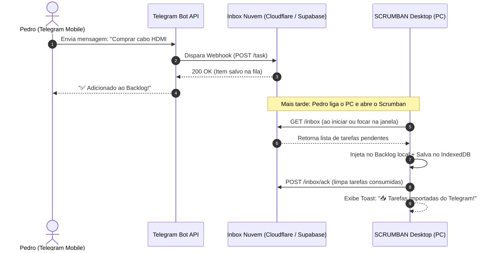

# Planejamento Técnico: Captura Remota de Tarefas via Telegram Bot & Inbox Desacoplada

> **Status:** 📋 Planejado para Implementação Futura  
> **Data de Planejamento:** 15 de Setembro de 2026  
> **Objetivo:** Permitir adicionar tarefas ao SCRUMBAN rapidamente pelo smartphone (via Telegram) sem precisar ligar o PC ou acessar a interface desktop no momento da captura.

---

## 1. Visão Geral e Arquitetura

Como o SCRUMBAN é uma aplicação **Offline-First** que persiste dados no navegador do computador (`IndexedDB`), o bot do Telegram não escreve diretamente no seu PC desligado. Em vez disso, adotamos o padrão **Inbox Desacoplada (Staging Queue)**.



---

## 2. Especificação do Bot do Telegram

### 2.1 Sintaxe de Envio de Mensagens

O bot processará tanto texto simples quanto tags inteligentes para facilitar o preenchimento sem formulários:

| Formato | Exemplo | Resultado no SCRUMBAN |
| :--- | :--- | :--- |
| **Simples (Só texto)** | `Lembrar de comprar ração` | **Título:** Lembrar de comprar ração<br>**Projeto:** Geral (ou 1º do array)<br>**Prioridade:** `media`<br>**Coluna:** `backlog` |
| **Com Projeto (`#`)** | `Ajustar tela de checkout #Meu Produto` | **Título:** Ajustar tela de checkout<br>**Projeto:** `Meu Produto`<br>**Prioridade:** `media` |
| **Com Prioridade (`!`)** | `Resolver bug de login !alta` | **Título:** Resolver bug de login<br>**Prioridade:** `alta` |
| **Com Prazo (`@`)** | `Entregar relatório @amanha` ou `@2026-09-20` | **Título:** Entregar relatório<br>**Prazo:** `2026-09-16` |
| **Combinado Completo** | `Renovar licença do domínio #Meu Produto !alta @2026-09-25` | Todos os campos populados cirurgicamente |

### 2.2 Segurança e Proteção
* **Whitelist de Usuário (`TELEGRAM_ALLOWED_USER_ID`)**: O bot validará o `chat_id` do remetente. Mensagens de terceiros serão ignoradas silenciosamente para prevenir inserções indevidas.

---

## 3. Camada de Armazenamento Temporário (Fase Provisória - Custo R$ 0)

Antes de ter o servidor local configurado no PC antigo, a fila de transição roda 24/7 de forma gratuita:

### Alternativa Recomendada: Cloudflare Workers + KV (ou D1)
- **Custo:** R$ 0 (100.000 requisições/dia gratuitas).
- **Sem Servidor:** Roda na borda da Cloudflare, sem necessidade de manter máquinas ligadas.
- **Endpoints:**
  - `POST /telegram-webhook`: Recebe updates do Telegram, faz o parse e salva no KV/D1 com status `pendente`.
  - `GET /api/inbox`: Chamado pelo SCRUMBAN no PC para listar tarefas pendentes. Protegido por chave secreta no header `x-api-key`.
  - `POST /api/inbox/ack`: Chamado pelo SCRUMBAN informando os IDs que foram persistidos localmente com sucesso, para deletá-los da fila na nuvem.

### Alternativa Secundária: Supabase (Postgres Grátis)
- Tabela `inbox_tasks`:
  ```sql
  create table inbox_tasks (
    id uuid primary key default gen_random_uuid(),
    title text not null,
    project text default 'Geral',
    priority text default 'media',
    due_date text,
    created_at timestamptz default now(),
    synced boolean default false
  );
  ```

---

## 4. Integração no SCRUMBAN Desktop

### 4.1 Configurações (`js/config.js`)
Adicionar seção de sincronização remota:
- Campo `Endpoint da Inbox`: `https://.../api/inbox`
- Campo `Token de Acesso`: Chave secreta de autenticação.
- Opção `Sincronização Automática`: `true`/`false`.

### 4.2 Módulo de Sincronização (`js/sync.js`)
- Executa em três gatilhos:
  1. No boot da aplicação (`inicializarArmazenamento()`).
  2. Ao focar na janela/aba (`window.addEventListener('focus')`).
  3. Botão manual na barra superior: `📥 Sincronizar Inbox`.
- Ao receber as tarefas:
  - Mapeia para o schema de tarefas do SCRUMBAN:
    ```javascript
    const novaTarefa = {
        id: gerarId('task'),
        title: item.title,
        description: item.description || '',
        priority: item.priority || 'media',
        column: 'backlog',
        order: 0,
        project: item.project || appState.settings.projects[0] || 'Geral',
        dueDate: item.dueDate || '',
        subtasks: [],
        parentId: null,
        sprintId: curSprint ? curSprint.id : null,
        createdAt: item.createdAt || new Date().toISOString()
    };
    ```
  - Insere no `appState.tasks` (no topo da coluna `backlog`).
  - Chama `saveState()` para persistir no `IndexedDB`.
  - Notifica o usuário: `mostrarToast('📥 2 novas tarefas importadas do Telegram!', 'sucesso')`.
  - Renderiza o card no DOM se a coluna ou filtros estiverem ativos.
  - Dispara o `POST /api/inbox/ack` para limpar a fila remota.

---

## 5. Transição Futura: Migração para o Servidor Local (PC Antigo)

Quando o computador antigo estiver preparado para atuar como Home Server:
1. **Nenhuma alteração no SCRUMBAN desktop**: O contrato da API permanece idêntico (`GET /inbox`, `POST /inbox/ack`).
2. **No servidor local**:
   - Um microserviço em Node.js ou Python (FastAPI) com banco SQLite local.
   - Um túnel seguro (ex: **Tailscale Funnel** ou **Cloudflare Tunnel**) expondo apenas o endpoint de webhook para o Telegram.
3. **No SCRUMBAN**: Apenas altera o `Endpoint da Inbox` nas configurações para o IP ou domínio local (ex: `http://servidor-antigo.local:3000/api/inbox`).

---

## 6. Roteiro de Implementação (Checklist de Fases)

- [ ] **Etapa 1: Setup do Bot no Telegram**
  - [ ] Criar bot no `@BotFather` e obter o `TELEGRAM_BOT_TOKEN`.
  - [ ] Descobrir o seu `chat_id` pessoal via `@userinfobot`.
- [ ] **Etapa 2: Backend Serverless da Fila (Cloudflare Worker ou Supabase)**
  - [ ] Criar o script de webhook com parser de texto, `#tags` e `!prioridades`.
  - [ ] Registrar o webhook no Telegram (`setWebhook`).
  - [ ] Testar envio de mensagem pelo celular e validação do armazenamento na nuvem.
- [ ] **Etapa 3: Integração no SCRUMBAN**
  - [ ] Criar módulo `js/sync.js` com funções de `fetchInbox()`, ingestão de cards no `Backlog` e `acknowledgeInbox()`.
  - [ ] Adicionar inputs de configuração (URL e Token) na aba de Configurações (`js/config.js`).
  - [ ] Conectar gatilhos automáticos (`boot`, `window focus` e botão manual no cabeçalho).
- [ ] **Etapa 4: Teste de Ponta a Ponta**
  - [ ] Enviar mensagem no celular com PC desligado.
  - [ ] Ligar o PC, abrir o SCRUMBAN e confirmar a aparição do card no Backlog com notificação toast.
- [ ] **Etapa 5: Migração Futura para Servidor Local**
  - [ ] Instalar servidor local no PC antigo com SQLite.
  - [ ] Configurar Tailscale / Cloudflare Tunnel.
  - [ ] Redirecionar URL nas configurações.
